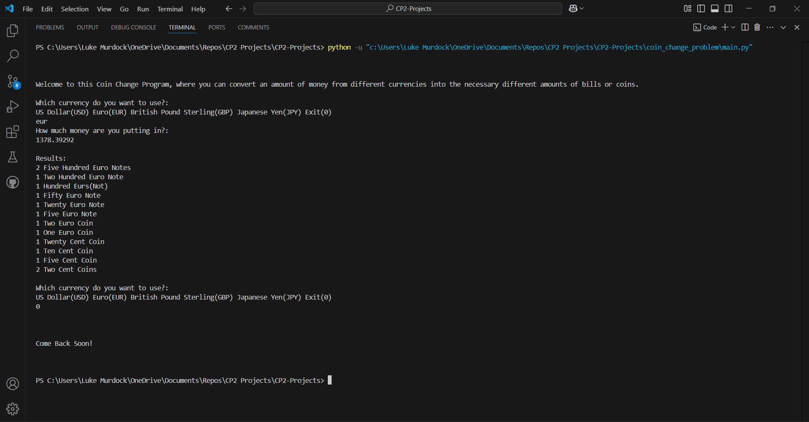

# Coin Change Problem

## Project Description
---
This program has the purpose of solving the coin change problem, which is finding out the least amount of coins and type of coins needed to equal a certain amount of money given. The solution to this problem makes it so, lets say, a vending machine doesn't give hundreds of pennies out as change. This program solves this problem for four of the most common currencies. These include the United States Dollar, the Euro, the British Pound, and the Japanese Yen. The program asks for the desired currency and amount of money inserted and then prints out the denominations of the currency and how much of each needed to solve the coin change problem.  

## Installation
---
Not used for this class  

## Execution and Usage
---
Paragraph describing how to use the project
To use this program you will have to run the main file's code with having the other files connected to it. The program will play in the terminal and starts with a concise description of the program. It then asks which of the four currencies they want to use. You will input the currencies name or abbreviation. If you want to exit, input 0. It will then ask how much money you want to put in and will subsequently print out the solution to the coin change problem. It will repeat by asking the desired currency again. The program will not accept inputs that are not the correct ones, but will instead give an error message and let you reinsert your input.
  

## Used Technologies
---
No imported libraries are used  

## Current Features
---
+ This program uses just one csv file that handles all of the information for multiple currencies
+ This program lets you solve the coin change problem easily
+ This program prints the needed denominations in a neat, efficent way

## Contributions
---
Not used for this class  

## Contributors
---
+ The Internet - Explained how different currencies worked such as what denominations they had  

## Author's Information
---
The author of this project is Luke Murdock and he is a student at UCAS, currently taking a programming class and creating projects like this one to help him learn python and the basics of programming. He mostly enjoys coding, expecially when it doesn't have many bugs and has a fun end product. He enjoys lots of other things including reading and playing games, including video games. He thinks it would be fun to eventually make some sort of actual game in the future if he ever gets the oppurtunity.  

## Change Log
---
Not used for this class  

## License
---
Not used for this class  