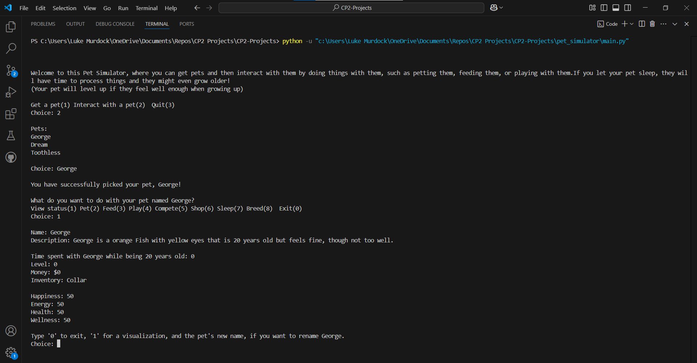

# Pet Simulator

## Project Description
---
The purpose of this pet simulator program is to let the user have a fun time with digital pets. This program lets you get new pets and then choose to interact with them in a variety of fun ways. It lets you **pet** them, **feed** them, **play** with them, watch them **compete**, go **shopping** for them, let them **sleep**, or let them **breed** to make new pets. Doing most actions will affect your pet's status, which is composed of how happy the pet is, how much energy it has, and how healthy it is. The average of these is what their wellness is. When your pet sleeps, they grow up depending on how much time has passed, and if they grow up, then they are able to level up if they feel well enough. Compete to gain money, shop to gain item, and use them, and randomly gained items, to have even more fun with your pet.  

## Installation
---
Not used for this class  

## Execution and Usage
---
To play this program, you will have to install the needed libraries and then play the code on something like VSCode. During your play with this program you are able to interact with the program by inputting info into the terminal. You mainly have to input a number that corresponds with an action or else you will usually have to input a word or name. If you input something wrong the program should then stop what it is doing and tell you how to fix your input for the program to work. How the actual game works is you get as many pets as you want and choose what species they are and then interact with one. The best thing to do is to pet, feed, play, and then sleep when they are well enough in happiness, energy, and health, to level up so then you are able to compete in some competitions. After hopefully winning a few, you should have enough money to expand the amount of items your pet has from the shop. You can use these items to more easily make your pet fell well cared for and let you have a fun time.

  

## Used Technologies
---
+ Faker
`pip install Faker`
+ Matplotlib
`pip install matplotlib`
+ Numpy
`pip install numpy`  

## Current Features
---
+ This program lets your pets get items from buying them or finding them
+ The items your pet gets let it do more activities and eat more diverse foods
+ This program lets you compete against randomly generated pets and earn money for winning

## Contributions
---
Not used for this class  

## Contributors
---
+ Documentations - helped using libraries
+ W3Schools - explained the math and random modules  

## Author's Information
---
The author of this project is Luke Murdock and he is a student at UCAS, currently taking a programming class and creating projects like this one to help him learn python and the basics of programming. He mostly enjoys coding, expecially when it doesn't have many bugs and has a fun end product. He enjoys lots of other things including reading and playing games, including video games. He thinks it would be fun to eventually make some sort of actual game in the future if he ever gets the oppurtunity.  

## Change Log
---
Not used for this class  

## License
---
Not used for this class  
